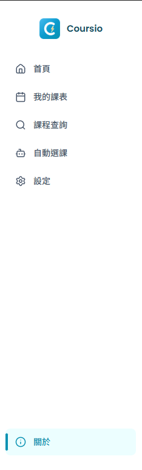
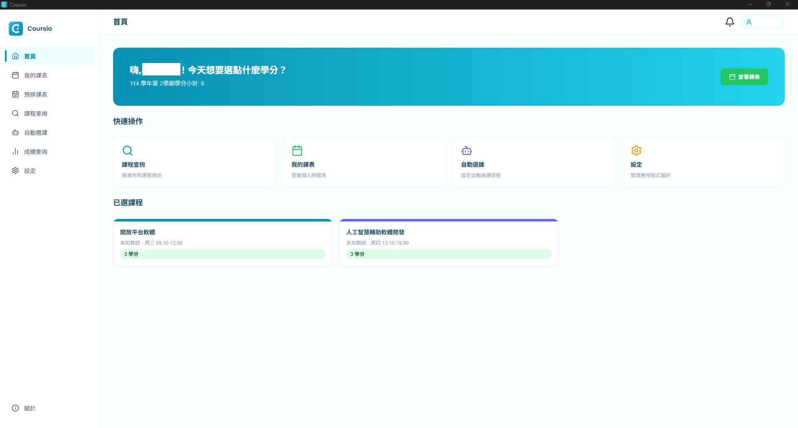
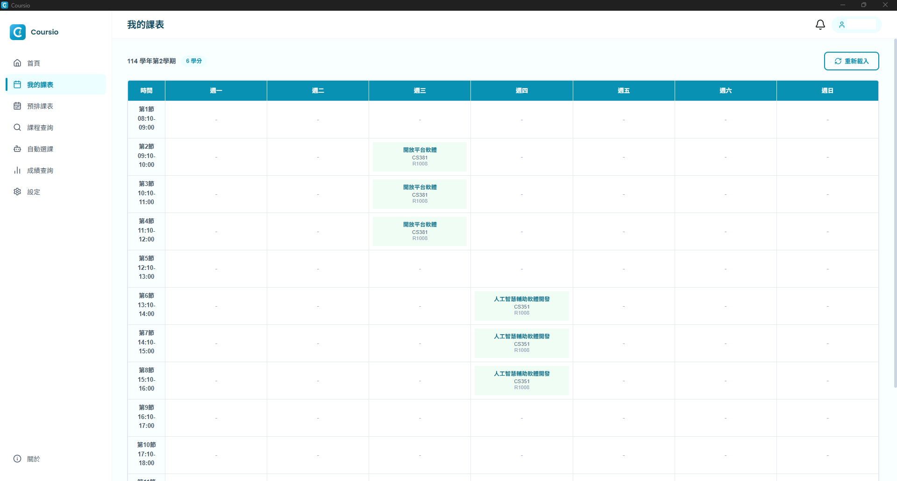
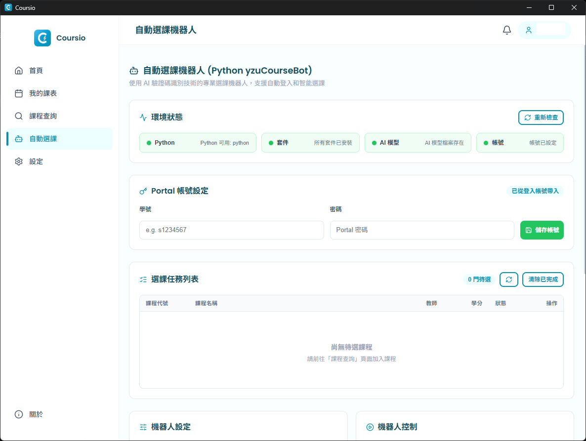
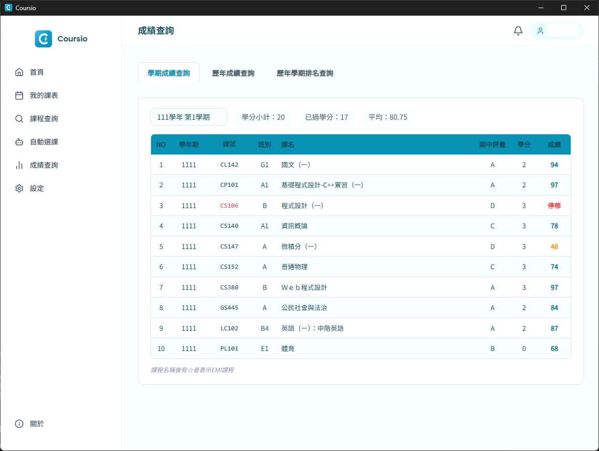
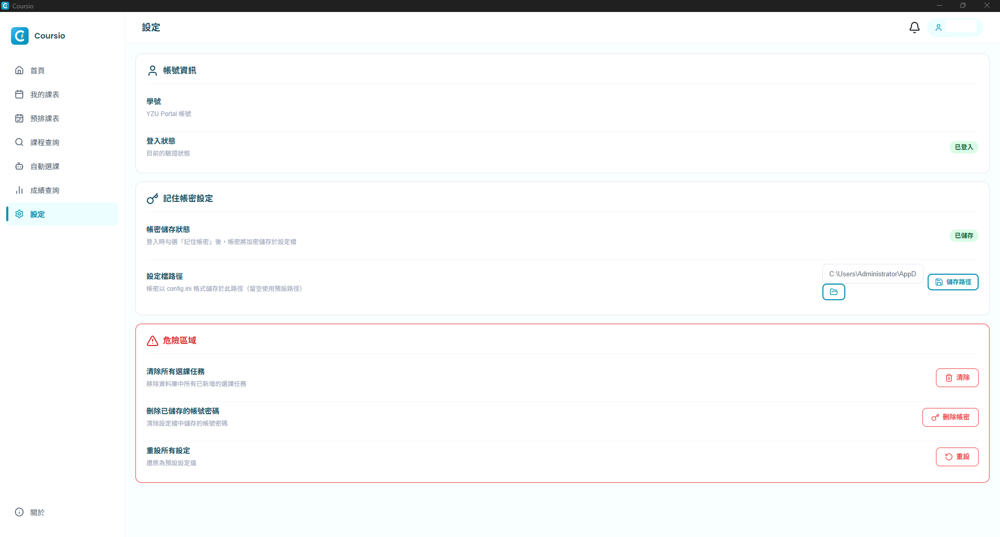
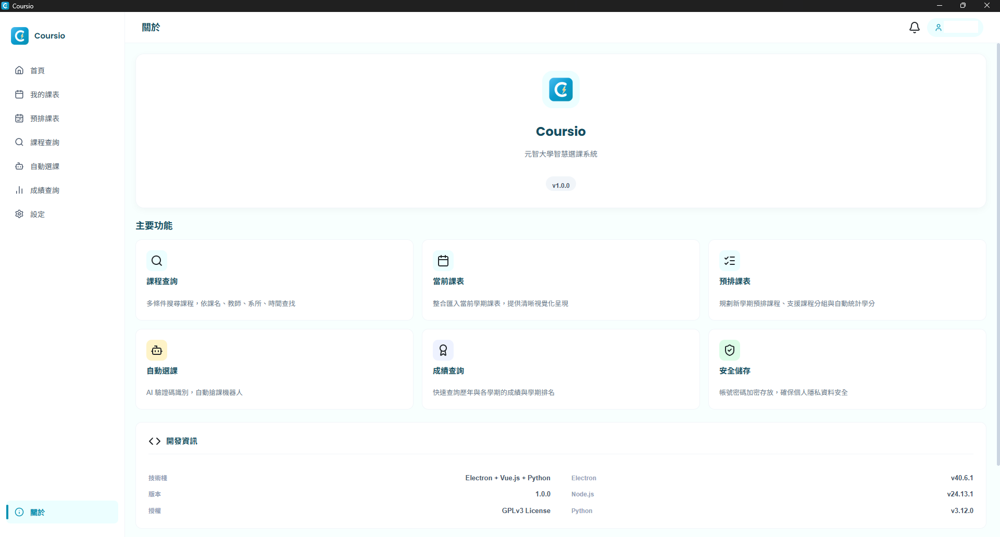

## 專案說明
本專案參考 [Wanna Class](https://github.com/MissterHao/WannaClass) 的框架進行重構，並擴充以下功能：
- 個人時間表
- 課程查詢
- 自動選課
- 訪客登入

### 架構重構
原始 Wanna Class 採用 Vanilla JS + jQuery 開發。本專案重構為以下技術棧：

| 層級 | 技術 |
|------|------|
| 框架 | Electron |
| 前端 | Vue 3 |
| 建置工具 | Vite + SCSS |
| 主程序 | Node.js（`app.js` / `main_ipc.js`） |
| 資料庫 | SQLite3 |
| 爬蟲 | Puppeteer |

# Coursio 元智選課系統

半夜依舊在電腦前守著？
想修熱門的課卻永遠搶不到？
查課表還在官網上輸入驗證碼慢慢搜尋？

那現在正是一個好時機嘗試全新的選課方式！

此軟體保證：

+ **不紀錄帳號密碼**
  使用元智 Portal 帳號密碼登入，不須擔心帳號密碼會被盜用或記錄，程式碼完全公開接受開源社群的檢驗，絕對安全。
+ **不對電腦造成額外負擔**
  不像其他程式會使用電腦挖礦，本程式使用最基本的方式簡化您電腦需要的資源！

## 功能展示

### 側邊導航

本系統分為以下多個核心板塊：

1. **首頁**
   

   快速查看目前的選課狀態、系統公告以及使用統計，讓您一目了然所有資訊。

2. **我的課表**
   

   以直觀的圖表記錄您已選過的課程，包含上課時間與地點，並支援匯出功能。

3. **課程查詢**
   

   快速查詢每學期的全校課表。點擊列表即可詳細顯示課程資訊（學分數、教室、教授名稱等），並可一鍵「加入選課清單」。

4. **自動選課**
   

   設定選課任務後，系統將模擬使用者行為進行全自動化搶課，大幅節省手動點擊的時間與壓力。

5. **成績查詢**
   

   快速查詢每學期的成績。

6. **系統設定**
   

   調整重試頻率、登入階段以及其他個性化偏好，讓軟體更符合您的使用習慣。

7. **關於系統**
   

   查看版本資訊、開發團隊以及相關授權文件。

---

### 登入與初始化

系統登入介面簡潔安全，並在載入時提供流暢的視覺體驗。

## License

This project is projected under GNU GPL v3 LICENCE.
