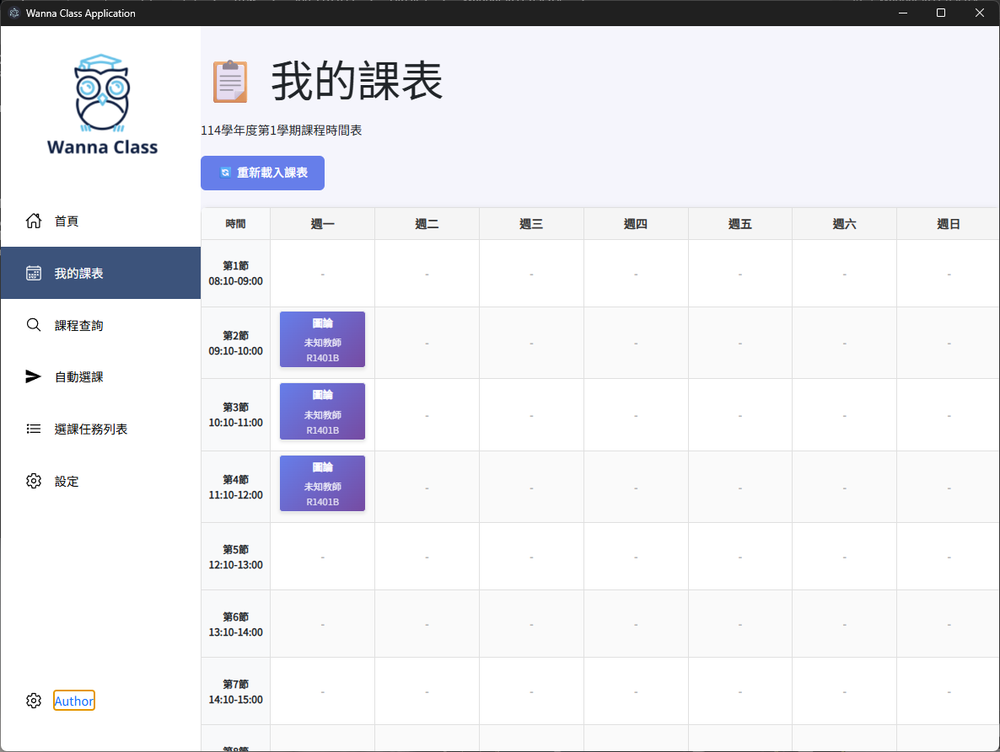
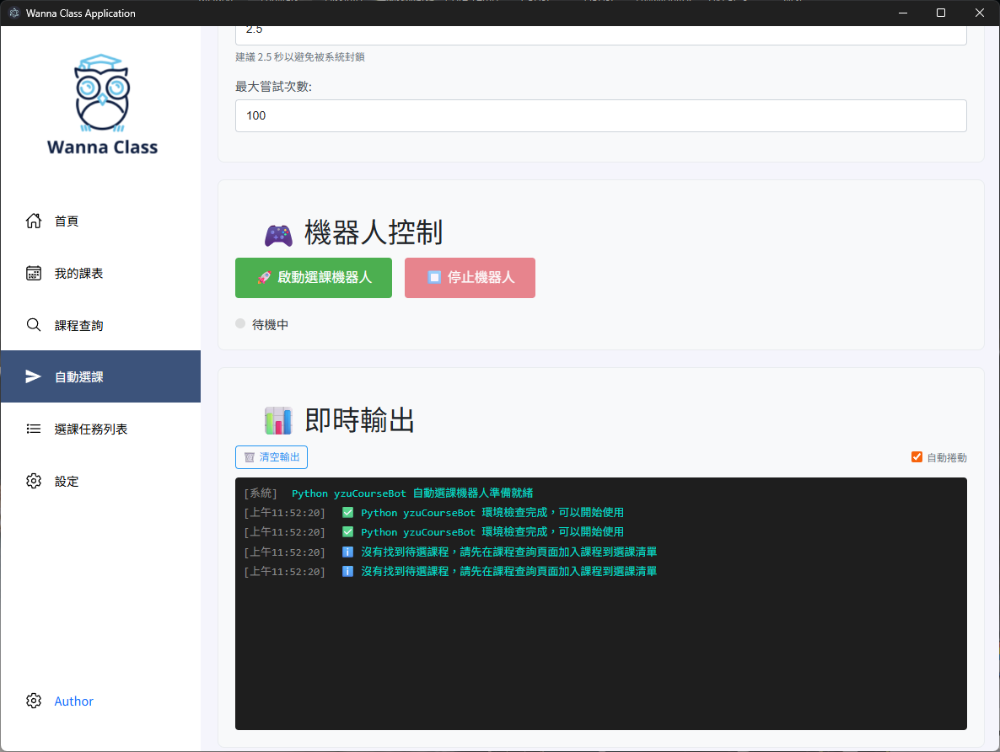

    

    

    

## 專案說明
本專案是基於原始 Wanna Class 進行 fork 並新增以下功能的版本。主要修改包括：
- 新增個人時間表
- 更改課程查詢的請求方法
- 新增自動選課功能
- 新增訪客登入功能

# Wanna Class 元智選課系統

半夜依舊在電腦前守著？
想修熱門的課卻永遠搶不到？
查課表還在官網上輸入驗證碼慢慢搜尋？

那現在正是一個好時機嘗試全新的選課方式！

此軟體保證：

+ **不紀錄帳號密碼**
  使用元智 Portal 帳號密碼登入，不須擔心帳號密碼會被盜用或記錄，程式碼完全公開接受開源社群的檢驗，絕對安全。
+ **不對電腦造成額外負擔**
  不像其他程式會使用電腦挖礦，本程式使用最基本的方式簡化您電腦需要的資源！

## 左方列表功能：

+ 課程查詢
  快速查詢每學期的課表，點擊列表可以顯示該課程資訊(學分數、上課教室、教授名稱等資訊)，列表最右方有「加入選課清單」按鈕可以加入選課任務列表中。

## 作者聲明

本程式只供本人學術上的作品集使用喔！

## License

This project is projected under GNU GPL v3 LICENCE.
